# MAgPIE Agent Query Handling Flowchart

**Purpose**: Visual guide showing how the agent routes and answers different types of MAgPIE questions.

---

## Complete Query Routing Flowchart

```mermaid
flowchart TD
    Start([User asks question]) --> CheckType{What type of question?}

    %% Module-specific questions
    CheckType -->|Module-specific| ModuleQ["'How does Module X work?'<br/>'What does livestock do?'"]
    ModuleQ --> ReadModuleDoc[Read modules/module_XX.md]
    ReadModuleDoc --> ReadNotes[Read module_XX_notes.md<br/>for warnings/lessons]
    ReadNotes --> HasAnswer{Docs answer<br/>question?}
    HasAnswer -->|Yes| CiteModule[Cite: module_XX.md<br/>+ notes if used]
    HasAnswer -->|No| ReadGAMS[Read GAMS code<br/>../modules/XX_name/]
    ReadGAMS --> CiteCode[Cite: module doc +<br/>code file:line]

    %% Cross-module questions
    CheckType -->|Cross-module| CrossQ["'How does X affect Y?'<br/>'What depends on Z?'"]
    CrossQ --> CheckPattern[Check Query_Patterns_Reference.md<br/>Pattern 2: Cross-Module Tracing]
    CheckPattern --> ReadPhase2[Read Phase2_Module_Dependencies.md<br/>for dependency graph]
    ReadPhase2 --> TraceChain[Trace mechanism chain<br/>X → intermediate → Y]
    TraceChain --> ReadMultiMods[Read relevant module docs<br/>for each step]
    ReadMultiMods --> CiteCross[Cite: all modules in chain]

    %% "Is X modeled?" questions
    CheckType -->|Parameterization| ParamQ["'Is X modeled?'<br/>'Does MAgPIE account for Y?'"]
    ParamQ --> CheckImplemented[Check Query_Patterns_Reference.md<br/>Pattern 1: Parameterized vs Implemented]
    CheckImplemented --> ThreeCheck{Run 3-check<br/>verification}
    ThreeCheck --> Check1[Check 1: Equation structure<br/>First principles or rates?]
    Check1 --> Check2[Check 2: Parameter source<br/>Calculated or input?]
    Check2 --> Check3[Check 3: Dynamic feedback<br/>State affects rate?]
    Check3 --> Classify{Classify approach}
    Classify -->|Fixed rates| Parameterized[Answer: PARAMETERIZED<br/>Uses IPCC/historical rates]
    Classify -->|From theory| Mechanistic[Answer: MECHANISTIC<br/>Models process]
    Classify -->|Mixed| Hybrid[Answer: HYBRID<br/>Some dynamic, some fixed]

    %% Temporal questions
    CheckType -->|Temporal| TempQ["'What happens after X?'<br/>'How does Y change over time?'"]
    TempQ --> CheckTemporal[Check Query_Patterns_Reference.md<br/>Pattern 3: Temporal Mechanism]
    CheckTemporal --> TraceSteps[Trace 5 steps:<br/>Initial → Transition → Convergence → Equilibrium → Timeframe]
    TraceSteps --> ReadModules[Read relevant modules<br/>for each temporal stage]
    ReadModules --> CiteTemporal[Cite: complete temporal chain]

    %% Modification safety
    CheckType -->|Modification| ModQ["'Can I modify Module X?'<br/>'What breaks if I change Y?'"]
    ModQ --> ReadSafety[Read modification_safety_guide.md]
    ReadSafety --> CheckCentrality{Is module in<br/>top 4 centrality?}
    CheckCentrality -->|Yes| HighRisk[HIGH RISK: 17+ dependents<br/>Read safety protocols]
    CheckCentrality -->|No| ReadDeps[Read Phase2_Module_Dependencies.md<br/>for specific dependents]
    HighRisk --> ListImpacts[List all affected modules<br/>+ conservation laws]
    ReadDeps --> ListImpacts
    ListImpacts --> WarnUser[Warn about impacts<br/>+ suggest testing]

    %% Conservation/balance questions
    CheckType -->|Conservation| BalQ["'Is land/water/carbon conserved?'<br/>'What are the constraints?'"]
    BalQ --> ReadBalance[Read cross_module/<br/>*_balance_conservation.md]
    ReadBalance --> CheckLaw{Which<br/>conservation?}
    CheckLaw -->|Land| LandBal[Read land_balance_conservation.md<br/>Strict equality constraint]
    CheckLaw -->|Water| WaterBal[Read water_balance_conservation.md<br/>Inequality with buffer]
    CheckLaw -->|Carbon| CarbonBal[Read carbon_balance_conservation.md<br/>Stock + emission tracking]
    CheckLaw -->|Nitrogen| NBal[Read nitrogen_food_balance.md<br/>N tracking + food balance]

    %% Data source questions
    CheckType -->|Data source| DataQ["'Where does this data come from?'<br/>'What input files are used?'"]
    DataQ --> ReadPhase3[Read Phase3_Data_Flow.md<br/>172 input files cataloged]
    ReadPhase3 --> FindFile[Find specific file<br/>+ data source]
    FindFile --> CiteData[Cite: file path + source<br/>+ calibration method]

    %% Architecture questions
    CheckType -->|Architecture| ArchQ["'How does MAgPIE execute?'<br/>'What's the structure?'"]
    ArchQ --> ReadPhase1[Read Phase1_Core_Architecture.md<br/>Model structure + execution]
    ReadPhase1 --> CiteArch[Cite: Phase1 sections]

    %% Debugging questions
    CheckType -->|Debugging| DebugQ["'Model failed - why?'<br/>'How do I fix infeasibility?'"]
    DebugQ --> CheckDebug[Check Query_Patterns_Reference.md<br/>Pattern 5: Debugging Tree]
    CheckDebug --> CheckStatus{What's<br/>modelstat?}
    CheckStatus -->|4 Infeasible| Infeas[Check binding constraints<br/>Land/water/food balance]
    CheckStatus -->|3 Unbounded| Unbound[Check missing costs<br/>or bounds]
    CheckStatus -->|13 Error| Error[Check .lst file<br/>for GAMS errors]
    CheckStatus -->|1-2 but wrong| Unrealistic[Check conservation laws<br/>Compare to FAO data]

    %% Final steps for all paths
    CiteModule --> ApplyGuidelines[Apply Response_Guidelines.md]
    CiteCode --> ApplyGuidelines
    CiteCross --> ApplyGuidelines
    Parameterized --> ApplyGuidelines
    Mechanistic --> ApplyGuidelines
    Hybrid --> ApplyGuidelines
    CiteTemporal --> ApplyGuidelines
    WarnUser --> ApplyGuidelines
    LandBal --> ApplyGuidelines
    WaterBal --> ApplyGuidelines
    CarbonBal --> ApplyGuidelines
    NBal --> ApplyGuidelines
    CiteData --> ApplyGuidelines
    CiteArch --> ApplyGuidelines
    Infeas --> ApplyGuidelines
    Unbound --> ApplyGuidelines
    Error --> ApplyGuidelines
    Unrealistic --> ApplyGuidelines

    ApplyGuidelines --> Checklist{Run quality<br/>checklist}
    Checklist --> CheckDocs[✓ Checked AI docs first?]
    CheckDocs --> CheckCite[✓ Cited sources?]
    CheckCite --> CheckVars[✓ Used exact variable names?]
    CheckVars --> CheckCode[✓ Described CODE behavior?]
    CheckCode --> CheckParam[✓ If 'models X': 3-check done?]
    CheckParam --> CheckLimit[✓ Stated limitations?]
    CheckLimit --> FinalAnswer([Send response with<br/>verification level 🟢🟡🔵])

    %% Styling
    classDef questionStyle fill:#e1f5ff,stroke:#0288d1,stroke-width:2px
    classDef docStyle fill:#fff3e0,stroke:#f57c00,stroke-width:2px
    classDef checkStyle fill:#f3e5f5,stroke:#7b1fa2,stroke-width:2px
    classDef answerStyle fill:#e8f5e9,stroke:#388e3c,stroke-width:2px
    classDef warnStyle fill:#ffebee,stroke:#c62828,stroke-width:2px

    class ModuleQ,CrossQ,ParamQ,TempQ,ModQ,BalQ,DataQ,ArchQ,DebugQ questionStyle
    class ReadModuleDoc,ReadNotes,ReadGAMS,ReadPhase1,ReadPhase2,ReadPhase3,ReadSafety docStyle
    class CheckType,HasAnswer,ThreeCheck,Classify,CheckCentrality,CheckLaw,CheckStatus,Checklist checkStyle
    class FinalAnswer answerStyle
    class HighRisk,WarnUser warnStyle
```



---

## Simplified Decision Tree (Text Version)

```
User Question
│
├─ Module-specific ("How does X work?")
│  ├─ Read: module_XX.md
│  ├─ Read: module_XX_notes.md
│  └─ If needed: Read GAMS code
│
├─ Cross-module ("How does X affect Y?")
│  ├─ Read: Query_Patterns_Reference.md (Pattern 2)
│  ├─ Read: Phase2_Module_Dependencies.md
│  └─ Trace: X → intermediate steps → Y
│
├─ Parameterization ("Is X modeled?")
│  ├─ Read: Query_Patterns_Reference.md (Pattern 1 + Appendix)
│  ├─ Apply: 3-check verification
│  │  ├─ Check 1: Equation structure
│  │  ├─ Check 2: Parameter source
│  │  └─ Check 3: Dynamic feedback
│  └─ Classify: MECHANISTIC / PARAMETERIZED / HYBRID
│
├─ Temporal ("What happens after X?")
│  ├─ Read: Query_Patterns_Reference.md (Pattern 3)
│  └─ Trace: Initial → Transition → Convergence → Equilibrium
│
├─ Modification ("Can I modify X?")
│  ├─ Read: modification_safety_guide.md
│  ├─ Read: Phase2_Module_Dependencies.md
│  └─ Warn: List dependents + conservation impacts
│
├─ Conservation ("Is X conserved?")
│  └─ Read: cross_module/*_balance_conservation.md
│
├─ Data source ("Where does X come from?")
│  └─ Read: Phase3_Data_Flow.md
│
├─ Architecture ("How does MAgPIE work?")
│  └─ Read: Phase1_Core_Architecture.md
│
└─ Debugging ("Model failed - why?")
   ├─ Read: Query_Patterns_Reference.md (Pattern 5)
   └─ Check: modelstat → specific debugging steps

ALL PATHS:
├─ Apply: Response_Guidelines.md (token efficiency, examples)
├─ Run: Quality checklist (7+ items)
└─ Send: Response with verification level (🟢🟡🔵)
```

---

## Query Type Examples

### 1. Module-Specific Query
**User**: "How does livestock work in MAgPIE?"

**Agent path**:
1. Read `modules/module_70.md` → 7 equations, feed baskets
2. Read `modules/module_70_notes.md` → warnings about feed constraints
3. Cite: 🟡 "Based on module_70.md and module_70_notes.md"

---

### 2. Cross-Module Query
**User**: "How does carbon pricing affect forests?"

**Agent path**:
1. Check `Query_Patterns_Reference.md` Pattern 2
2. Read `circular_dependency_resolution.md` → Forest-Carbon cycle
3. Read `module_56.md` (GHG policy), `module_32.md` (forestry), `module_52.md` (carbon)
4. Trace: vm_carbon_price → afforestation cost → carbon stock growth
5. Cite: 🟡 "Based on circular_dependency_resolution.md, module_32/52/56.md"

---

### 3. Parameterization Query
**User**: "Does MAgPIE model tillage effects on soil organic matter?"

**Agent path**:
1. Check `Query_Patterns_Reference.md` Pattern 1
2. Apply 3-check verification:
   - Check 1: Equation applies IPCC factors
   - Check 2: f59_cratio_tillage from input files
   - Check 3: Hardcoded to 100% full_tillage
3. Classify: PARAMETERIZED but NOT IMPLEMENTED
4. Answer: "Infrastructure exists but hardcoded to defaults (preloop.gms:52)"
5. Cite: 🟢 "Verified in module_59.md + equations.gms:45"

---

### 4. Modification Safety Query
**User**: "Can I modify Module 10 (land) without breaking things?"

**Agent path**:
1. Read `modification_safety_guide.md` → Module 10 is **highest centrality**
2. Read `Phase2_Module_Dependencies.md` → 23 dependents
3. List affected: Modules 11, 14, 17, 18, 29-32, 35, 38-40, 42, 52, 56, 58-59, 70-71, 73
4. Warn: Affects ALL conservation laws (land, water, carbon, nitrogen)
5. Recommend: Extensive testing, check all dependents
6. Cite: 🟡 "Based on modification_safety_guide.md, Phase2_Module_Dependencies.md"

---

## Token Efficiency by Query Type

| Query Type | Typical Docs Read | Token Budget | Time |
|------------|------------------|--------------|------|
| Simple module | 1 module doc | ~3,000 | 30s |
| Module + notes | 1 module + notes | ~4,500 | 1min |
| Cross-module | 3-4 module docs | ~8,000 | 2min |
| Parameterization | Pattern + module + code | ~6,000 | 2min |
| Modification safety | Safety guide + Phase2 + module | ~10,000 | 3min |
| Temporal mechanism | Pattern + multiple modules | ~8,000 | 2min |
| Conservation laws | Cross-module balance docs | ~5,000 | 2min |
| Architecture | Phase1 | ~10,000 | 3min |

**Key principle**: Read ONLY what's needed for the specific question. Stop when you have the answer.

---

## Verification Levels

**Every response includes verification status:**

- 🟢 **Verified**: Read actual GAMS code this session (file.gms:123)
- 🟡 **Documented**: Read AI docs this session (module_XX.md)
- 🟠 **Literature**: Published papers (Author et al. YEAR)
- 🔵 **General**: Domain knowledge (not model-specific)
- 🔴 **Inferred**: Training data (lowest confidence)

**Default for MAgPIE questions**: 🟡 (documented) or 🟢 (verified against code)

---

## Summary

**The agent uses a decision tree approach:**
1. **Classify** the question type
2. **Route** to appropriate documentation
3. **Apply** relevant pattern (if complex)
4. **Verify** with checklist
5. **Cite** sources with verification level

**All paths converge on**: Quality checklist → Verified response → Proper citation
